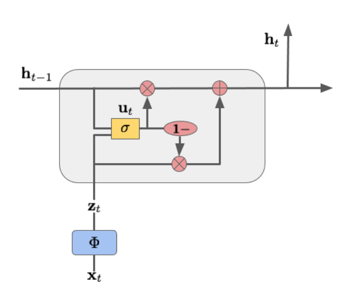

# minmin-minimalrnn

Original source cloned from simonnanty's gist:
https://gist.github.com/simonnanty/bf56dd6ae3cc9566cd3f004431ff512d


# What

This repository contains an implementation of Minimal RNN by [M. Chen, 2017](https://arxiv.org/abs/1711.06788v1)

MinimalRNN: Toward More Interpretable and Trainable Recurrent Neural Networks
https://arxiv.org/abs/1711.06788v1



# Use

Just import `minimalrnn.py`:

  `from minimalrnn import MinimalRNNCell`

and then use `MinimalRNNCell` like any other `RNNCell` objects.

`example-mnist-minimal-rnn.ipynb` contains a simple MNIST RNN example, tried to show how to create a custom phi transformation function for the minimal-RNN.

Caveats: I couldn't use `tf.layers.batch_normalization()` in the custom phi transform because of following error:

  ```
  InvalidArgumentError: The node 'gradients/rnn/TensorArrayStack/TensorArrayGatherV3_grad/TensorArrayGrad/TensorArrayGradV3' has inputs from different frames. The input 'rnn/while/rnn/minimal_rnn_cell/batch_normalization/AssignMovingAvg' is in frame 'rnn/while/while_context'. The input 'rnn/TensorArray' is in frame ''.
  ```

Any suggestion for above issue will be welcomed. :-)

Thank you for reading this.
